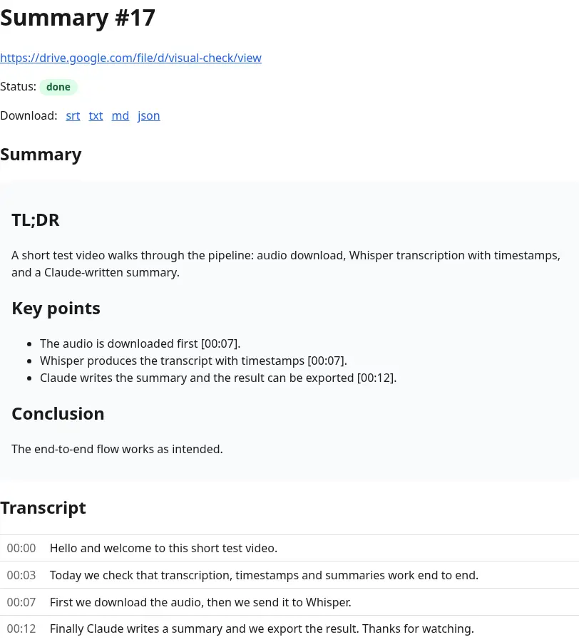

# summorization

Paste a public Google Drive link to a video or audio file → get a timestamped transcript and a summary. Watch the progress live, then download the result as `srt`, `txt`, `md`, or `json`.



## Run

```sh
cp .env.example .env   # put OPENAI_API_KEY and ANTHROPIC_API_KEY in it
make start             # docker compose up --build
```

Open http://localhost:3000, paste a link, press **Summarize**.

| Variable | Purpose |
|---|---|
| `OPENAI_API_KEY` | Whisper transcription (`whisper-1`, ~$0.006 / audio minute) |
| `ANTHROPIC_API_KEY` | Claude summary (`claude-sonnet-4-5`, fractions of a cent per video) |
| `FAKE_SERVICES=true` | Optional. Replaces downloader/Whisper/Claude with fixtures — no keys, no network. Used by `make test`. |

## Test

```sh
make test   # restarts the stack with FAKE_SERVICES=true, then runs all three layers
```

- `web/test` — Rails Minitest: model, controller, job (services stubbed), exporters.
- `downloader/test` — `node:test`: HTTP contract with `yt-dlp` stubbed.
- `e2e/` — Playwright against the real stack in fake mode: submit, live status sequence over WebSocket, failure path, downloads.

Same suite runs in GitHub Actions on every push. `make start` afterwards returns to real APIs.

## How it works

```
browser ──form──▶ web (Rails 8) ──POST /download──▶ downloader (Node + yt-dlp + ffmpeg)
   ▲                 │  ▲                                   │
   │ Turbo Streams   │  └──── reads /data/<id>.mp3 ◀────────┘ writes
   │ (WebSocket)     ├──▶ OpenAI whisper-1 (segments + timestamps)
   └─────────────────┴──▶ Anthropic Claude (markdown summary)
```

- `web` — form, `Summary` row, `TranscribeJob` on Solid Queue (runs inside Puma), result page updated through Turbo Streams + Solid Cable, exports. SQLite for everything; no Redis.
- `downloader` — `POST /download {url, id}` starts a job (`202`), `GET /download/:id` reports `running | done | failed`. Shells out to `yt-dlp` for the mp3 on the shared `media` volume and, above `CHUNK_BYTES` (20 MB), splits it with `ffmpeg` into Whisper-sized chunks with their start offsets.
- Status flow: `pending → downloading → transcribing → summarizing → done | failed`. The mp3 is deleted once transcribed.

Diagrams (C4 container + sequence): [docs/architecture.md](docs/architecture.md). Build log: [docs/plan.md](docs/plan.md).

## Limitations

- Drive file must be shared as "anyone with the link"; private files fail with the yt-dlp error shown on the page.
- Whisper accepts ≤ 25 MB per request; larger audio is split into chunks and the timestamps are stitched back into one timeline. Very long recordings just take longer (one Whisper call per ~20 MB).
- No authentication: every summary is reachable by its URL.
