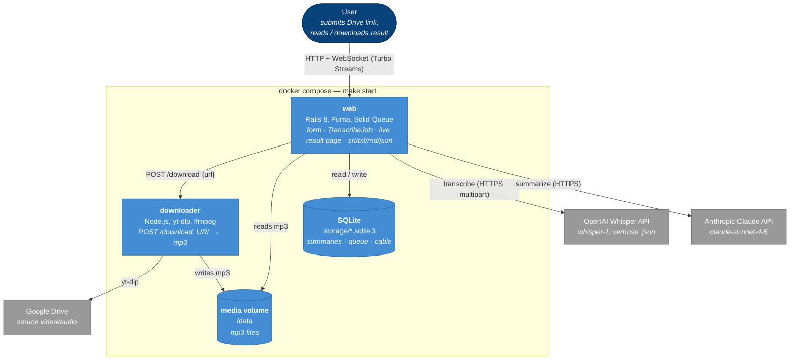
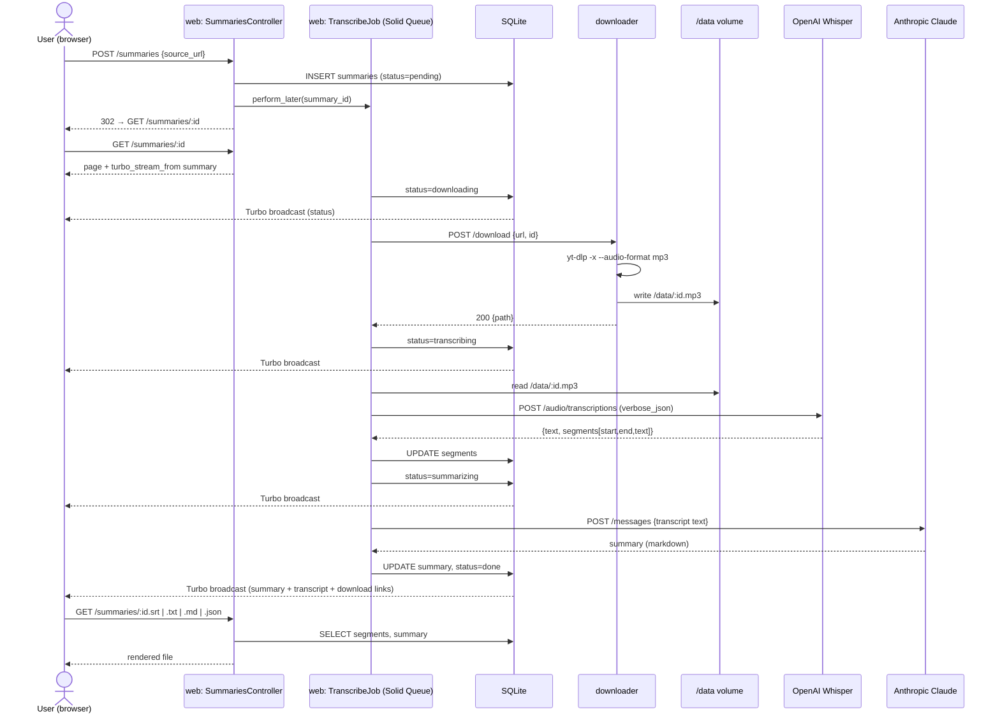

# Architecture

## 1. Structure — container diagram (C4 level 2)

Static view: deployable units and dependencies. No ordering.

## 2. Behavior — sequence diagram, happy path

Dynamic view: one scenario, "submit URL → summary shown".

